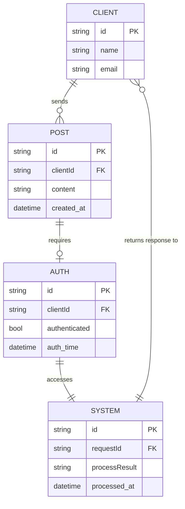

  

```mermaid
erDiagram
CLIENT {
  string id PK
  string name
  string email
}

POST {
  string id PK
  string clientId FK
  string content
  datetime created_at
}

AUTH {
  string id PK
  string clientId FK
  bool authenticated
  datetime auth_time
}

SYSTEM {
  string id PK
  string requestId FK
  string processResult
  datetime processed_at
}

CLIENT ||--o{ POST: "sends"
POST ||--o| AUTH: "requires"
AUTH ||--|| SYSTEM: "accesses"
SYSTEM ||--o{ CLIENT: "returns response to"
```

    

  

